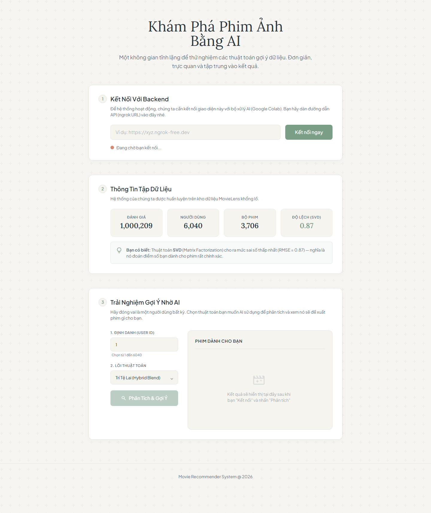
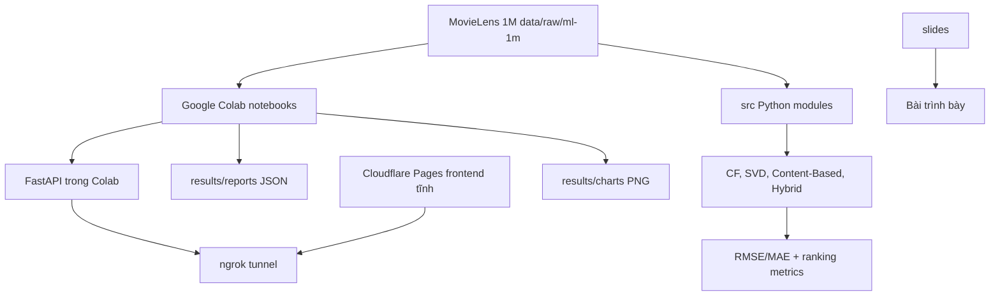

# Movie Recommendation System - Pipeline gợi ý phim MovieLens 1M


Repo này là một đồ án recommender system trên MovieLens 1M, gồm ba lớp rõ ràng:

1. Notebook pipeline để EDA, train model, đánh giá, export kết quả và mở API demo.
2. Python modules dùng chung cho load dataset, 5 thuật toán, metrics và context analysis.
3. Frontend tĩnh kết nối tới FastAPI chạy trong Google Colab qua ngrok.

Điểm mạnh của repo không nằm ở một website phức tạp, mà nằm ở việc giải thích và triển khai đủ các hướng gợi ý chính: collaborative filtering, matrix factorization, content-based, hybrid, metrics ranking và phân tích ngữ cảnh.

## Giao diện demo hiện tại



## Hệ thống đang có gì?

| Lớp | Trạng thái hiện tại | Source |
|---|---|---|
| Dataset | MovieLens 1M có sẵn `ratings.dat`, `movies.dat`, `users.dat`. | `data/raw/ml-1m/**`, `src/data_loader.py` |
| Thuật toán | User-Based CF, Item-Based CF, SVD, Content-Based TF-IDF, Hybrid SVD + Content-Based. | `src/models.py`, `notebooks/02_*` đến `06_*` |
| Đánh giá | RMSE, MAE, Precision@K, Recall@K, F1@K, MAP@K, NDCG@K. | `src/evaluation.py`, `notebooks/08_evaluation.ipynb` |
| Context | Timestamp, ngày/giờ/năm, giới tính, nhóm tuổi, nghề nghiệp, genre preference. | `src/context.py`, `notebooks/07_context_features.ipynb` |
| Full pipeline | Notebook chạy toàn bộ, export JSON và định nghĩa FastAPI endpoints. | `notebooks/00_full_pipeline.ipynb` |
| Web demo | HTML/Tailwind tĩnh, người dùng dán ngrok URL rồi gọi `/api/recommend`. | `frontend/index.html`, `frontend/app.js` |
| Trình bày | PowerPoint, notes, ảnh công thức, diagram và hình minh họa. | `slides/**` |

## Kiến trúc



## Vì sao chọn thiết kế này?

### 1. Vì sao dùng MovieLens 1M?

MovieLens 1M đủ lớn để thấy bài toán ma trận thưa, cold start, metrics và khác biệt giữa CF/SVD/CB; nhưng vẫn đủ nhỏ để chạy được trên Colab. Nó có ba file quan trọng: ratings, movies, users. Nhờ đó repo không chỉ train model mà còn phân tích ngữ cảnh theo thời gian và demographic.

### 2. Vì sao có cả CF, SVD, Content-Based và Hybrid?

Mỗi thuật toán trả lời một góc khác nhau:

- User-Based CF giải thích trực giác “người giống bạn”.
- Item-Based CF ổn định hơn khi item ít thay đổi hơn user.
- SVD xử lý ma trận rating thưa bằng latent factors.
- Content-Based dùng genres để giải thích và hỗ trợ cold start.
- Hybrid trộn SVD với content score để không phụ thuộc vào một nguồn tín hiệu.

### 3. Vì sao backend nằm trong Colab?

Train MovieLens và chạy model tương đối nặng với một frontend tĩnh. Repo chọn Colab + FastAPI + ngrok để demo nhanh, không cần thuê server luôn bật. Đổi lại, ngrok URL thay đổi khi runtime restart, nên đây là demo topology, không phải production architecture.

## Thuật toán

| Thuật toán | Cài đặt | Vai trò |
|---|---|---|
| User-Based CF | `KNNWithMeans`, cosine similarity theo user | Baseline collaborative filtering dễ giải thích nhất. |
| Item-Based CF | `KNNWithMeans`, `user_based=False` | So sánh hướng similarity theo item. |
| SVD | `surprise.SVD`, mặc định 50 factors | Baseline chính cho prediction trên sparse matrix. |
| Content-Based | TF-IDF trên `genres`, cosine similarity | Gợi theo nội dung phim, dễ giải thích. |
| Hybrid | Weighted SVD + content score, mặc định `cf_weight=0.6` | Kết hợp tín hiệu rating và genres. |

## API trong notebook full pipeline

API hiện được định nghĩa trong `notebooks/00_full_pipeline.ipynb`.

| Method | Endpoint | Chức năng |
|---|---|---|
| `GET` | `/api/health` | Frontend kiểm tra Colab backend còn sống. |
| `POST` | `/api/recommend` | Nhận `{ user_id, algorithm, top_n }` và trả danh sách phim gợi ý. |
| `GET` | `/api/stats` | Trả thống kê dataset/model cho demo. |
| `GET` | `/api/evaluation` | Trả tóm tắt kết quả đánh giá. |

## Chạy dự án

Cài dependencies:

```bash
pip install -r requirements.txt
```

Load dataset bằng module:

```python
from src.data_loader import load_movielens

ratings, movies, users = load_movielens()
```

Chạy demo đầy đủ:

1. Mở `notebooks/00_full_pipeline.ipynb` trên Google Colab.
2. Run all.
3. Copy ngrok URL ở cell cuối.
4. Mở `frontend/index.html` hoặc deploy `frontend/` lên Cloudflare Pages.
5. Dán ngrok URL vào frontend để gọi API.

## Tài liệu sâu

- [Mục lục tài liệu](docs/00-README.md)
- [Đặc tả current-state](docs/08-current-technical-specification.md)
- [Deploy guide](DEPLOY.md)
- [Slide notes](slides/notes.md)
- [English README](README.md)

