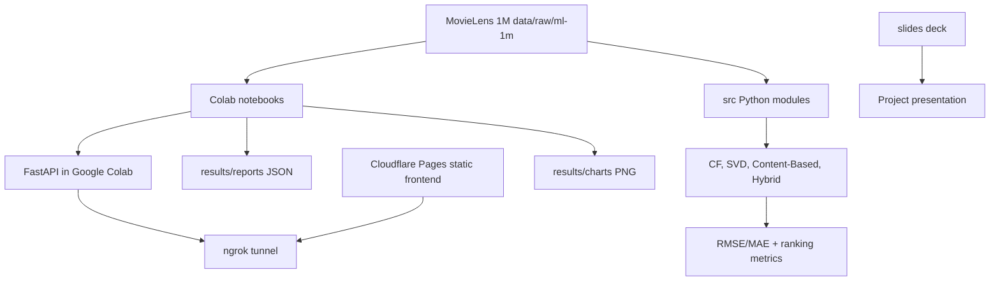

# Movie Recommendation System - MovieLens 1M Research Pipeline


This repository is a MovieLens 1M recommender-system project with three layers:

1. A notebook pipeline for EDA, model training, evaluation, and export.
2. Shared Python modules for dataset loading, five algorithms, ranking metrics, and context analysis.
3. A static web frontend that connects to a temporary Google Colab FastAPI backend through ngrok.

The project is intentionally educational and research-oriented. It does not hide the tradeoffs: collaborative filtering is useful but cold-start sensitive; content-based filtering is explainable but narrow; SVD is the strongest baseline; the hybrid recommender combines SVD with genre similarity; and the frontend only becomes interactive after a Colab API URL is supplied.

## Current Demo Surface


## What Is Actually Implemented

| Layer | Current implementation | Source |
|---|---|---|
| Dataset | MovieLens 1M with `ratings.dat`, `movies.dat`, `users.dat`; dataset files are present under `data/raw/ml-1m`. | `data/raw/ml-1m/**`, `src/data_loader.py` |
| Algorithms | User-Based CF, Item-Based CF, SVD, Content-Based TF-IDF, Hybrid SVD + Content-Based. | `src/models.py`, `notebooks/02_*` to `06_*` |
| Evaluation | RMSE, MAE, Precision@K, Recall@K, F1@K, MAP@K, NDCG@K. | `src/evaluation.py`, `notebooks/08_evaluation.ipynb` |
| Context analysis | Temporal features from timestamp and demographics from `users.dat`. | `src/context.py`, `notebooks/07_context_features.ipynb` |
| Full pipeline | Run-all notebook trains/evaluates, exports JSON, and defines FastAPI endpoints. | `notebooks/00_full_pipeline.ipynb` |
| Web demo | Static HTML/Tailwind client that connects to `/api/health` and `/api/recommend` on a pasted ngrok URL. | `frontend/index.html`, `frontend/app.js` |
| Presentation | PowerPoint, slide notes, formula images, and explanatory diagrams. | `slides/**` |

## Architecture



## Algorithm Map

| Algorithm | Implementation | Why it exists |
|---|---|---|
| User-Based CF | `KNNWithMeans`, cosine similarity over users | Easiest collaborative-filtering baseline: “users like you liked this”. |
| Item-Based CF | `KNNWithMeans`, `user_based=False` | More stable similarity direction: “items similar to what you rated”. |
| SVD | `surprise.SVD`, 50 latent factors by default | Main predictive baseline for sparse rating matrices. |
| Content-Based | TF-IDF over `genres`, cosine similarity | Explainable genre-based fallback for cold-start and item similarity. |
| Hybrid | Weighted SVD + content score, default CF weight `0.6` | Combines rating signal with genre similarity instead of relying on one view. |

## API Contract In The Full Pipeline

The API is defined inside `notebooks/00_full_pipeline.ipynb`, not as a checked-in FastAPI app module.

| Method | Endpoint | Purpose |
|---|---|---|
| `GET` | `/api/health` | Frontend connection check. |
| `POST` | `/api/recommend` | Returns top-N recommendations for `{ user_id, algorithm, top_n }`. |
| `GET` | `/api/stats` | Dataset/model summary for demo. |
| `GET` | `/api/evaluation` | Evaluation summary exported from the notebook run. |

## Run Locally

Install Python dependencies:

```bash
pip install -r requirements.txt
```

Load the dataset:

```python
from src.data_loader import load_movielens

ratings, movies, users = load_movielens()
```

Run the full demo backend:

1. Open `notebooks/00_full_pipeline.ipynb` in Google Colab.
2. Run all cells.
3. Copy the ngrok URL printed by the final deploy cell.
4. Open `frontend/index.html` or deploy `frontend/` to Cloudflare Pages.
5. Paste the ngrok URL into the web UI.

## Documentation

- [Vietnamese README](README-vi.md)
- [Docs index](docs/00-README.md)
- [Current technical specification](docs/08-current-technical-specification.md)
- [Deploy guide](DEPLOY.md)
- [Slide notes](slides/notes.md)

## Current Risks

| Risk | Meaning |
|---|---|
| Colab/ngrok backend | The API URL changes whenever Colab restarts; this is a demo topology, not production hosting. |
| Full pipeline lives in notebook | FastAPI endpoints are not a normal deployable app package yet. |
| `scikit-surprise` install friction | The package can be sensitive to Python/NumPy/compiler versions. |
| In-memory model serving | Models are trained/held inside the notebook runtime; no persistent model registry. |
| Frontend depends on pasted URL | Cloudflare Pages serves only static files and cannot infer the backend URL automatically. |
