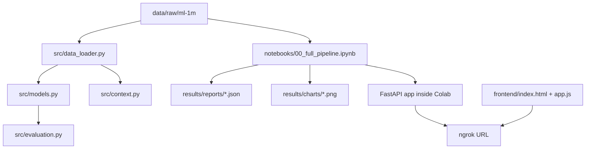

# Movie Recommendation System - Đặc tả current-state

> File này mô tả trạng thái source hiện tại: cái gì đã có thật trong repo, cái gì chạy qua notebook, cái gì chỉ là frontend tĩnh, và những giới hạn vận hành cần biết.

## 1. Bài toán

Repo giải bài toán gợi ý phim trên MovieLens 1M. Input chính là lịch sử rating 1-5 sao giữa user và movie. Output là danh sách top-N phim được xếp hạng theo thuật toán được chọn.

MovieLens 1M trong repo gồm:

| File | Vai trò |
|---|---|
| `ratings.dat` | `userId`, `movieId`, `rating`, `timestamp`; nguồn chính cho CF/SVD/evaluation/temporal. |
| `movies.dat` | `movieId`, `title`, `genres`; nguồn chính cho content-based và hybrid. |
| `users.dat` | `userId`, `gender`, `age`, `occupation`, `zipcode`; nguồn context/demographics. |

## 2. Kiến trúc



## 3. Python modules

| Module | Trách nhiệm |
|---|---|
| `src/constants.py` | Paths, dataset columns, model defaults, evaluation constants. |
| `src/data_loader.py` | Load MovieLens 1M, parse `::`, latin-1 movies, temporal/demographic helpers. |
| `src/models.py` | 5 recommenders: User CF, Item CF, SVD, Content-Based, Hybrid. |
| `src/evaluation.py` | Prediction metrics and ranking metrics. |
| `src/context.py` | Temporal analysis, demographics analysis, genre preference by group. |

### 3.1 Model defaults

| Constant | Value | Ý nghĩa |
|---|---:|---|
| `DEFAULT_K` | `40` | Số neighbors cho KNN CF. |
| `DEFAULT_SVD_FACTORS` | `50` | Số latent factors cho SVD. |
| `DEFAULT_N_EPOCHS` | `20` | Số epochs train SVD. |
| `DEFAULT_CF_WEIGHT` | `0.6` | Trọng số SVD/CF trong Hybrid. |
| `TEST_SIZE` | `0.2` | Train/test split mặc định. |
| `RANDOM_SEED` | `42` | Reproducibility. |

## 4. Thuật toán

### 4.1 User-Based CF

`train_user_cf` dùng `surprise.KNNWithMeans` với cosine similarity theo user. Nó dự đoán rating cho unseen movies bằng hành vi của các user gần nhất.

Ưu điểm: dễ giải thích.

Nhược điểm: tốn kém khi user nhiều, nhạy với sparse data và cold start.

### 4.2 Item-Based CF

`train_item_cf` cũng dùng `KNNWithMeans`, nhưng đặt `user_based=False`. Ý tưởng là so sánh item với item, thường ổn định hơn vì movie ít đổi hơn user.

### 4.3 SVD

`train_svd` dùng `surprise.SVD` với 50 latent factors mặc định. Đây là baseline mạnh nhất cho prediction trên sparse user-item matrix.

### 4.4 Content-Based

`ContentBasedModel` biến `genres` thành TF-IDF vector, sau đó dùng cosine similarity để tìm phim giống với những phim user đã rating cao.

Ưu điểm: dễ giải thích và có ích khi thiếu collaborative signal.

Nhược điểm: chỉ biết những feature có trong `movies.dat`, chủ yếu là genres.

### 4.5 Hybrid

`HybridRecommender` trộn SVD score với content score:

```text
hybrid_score = cf_weight * svd_pred + (1 - cf_weight) * cb_score
```

Implementation hiện đã pre-compute cosine similarity matrix để content score không phải tính lại quá nhiều lần.

## 5. Evaluation

`src/evaluation.py` có hai nhóm metrics:

| Nhóm | Metrics | Câu hỏi trả lời |
|---|---|---|
| Prediction | RMSE, MAE | Model đoán rating sát thực tế đến đâu? |
| Ranking | Precision@K, Recall@K, F1@K, MAP@K, NDCG@K | Top-N recommendation có đúng và đúng thứ tự không? |

Đây là điểm tốt của repo: không chỉ đo RMSE. Recommender thực tế cần ranking metrics vì người dùng nhìn danh sách gợi ý, không nhìn từng rating predicted.

## 6. Notebook pipeline

| Notebook | Vai trò |
|---|---|
| `01_setup_eda.ipynb` | Setup, load data, EDA. |
| `02_user_cf.ipynb` | User-Based CF. |
| `03_item_cf.ipynb` | Item-Based CF. |
| `04_svd.ipynb` | SVD và latent factors. |
| `05_content_based.ipynb` | TF-IDF genres và content similarity. |
| `06_hybrid.ipynb` | Weighted hybrid. |
| `07_context_features.ipynb` | Temporal và demographics. |
| `08_evaluation.ipynb` | So sánh metrics và export. |
| `00_full_pipeline.ipynb` | Run-all pipeline, export JSON, mở FastAPI/ngrok. |

## 7. API trong Colab

API không nằm trong `src/` như một service deploy độc lập. Nó được định nghĩa trong cell cuối của `notebooks/00_full_pipeline.ipynb`.

| Endpoint | Trạng thái |
|---|---|
| `GET /api/health` | Frontend dùng để kiểm tra kết nối. |
| `POST /api/recommend` | Nhận `user_id`, `algorithm`, `top_n`; trả recommendations. |
| `GET /api/stats` | Trả thống kê demo. |
| `GET /api/evaluation` | Trả evaluation summary. |

`frontend/app.js` luôn gửi header `ngrok-skip-browser-warning: true` để tránh trang cảnh báo ngrok.

## 8. Frontend

Frontend là static HTML/JS:

- Tailwind CDN;
- form nhập ngrok URL;
- health check;
- user id input;
- algorithm select;
- render recommendation cards từ `/api/recommend`.

Nó không train model, không chứa model, không đọc dataset. Nó chỉ là client cho Colab API.

## 9. Rủi ro và giới hạn

| Rủi ro | Ý nghĩa |
|---|---|
| Colab runtime tạm thời | Mất backend khi tab/runtime tắt. |
| Ngrok URL thay đổi | Người dùng phải dán lại URL mỗi lần restart. |
| API ở notebook | Khó test/deploy như service bình thường. |
| Surprise dependency | Có thể vướng Python/NumPy/compiler khi cài local. |
| Content feature nghèo | `movies.dat` chỉ có genres/title, không có cast/director/plot. |
| Dataset cũ | MovieLens 1M phản ánh hành vi giai đoạn 2000-2003, không phải xu hướng phim hiện đại. |

## 10. Nâng cấp hợp lý

1. Tách FastAPI từ notebook ra `api/` hoặc `src/api.py`.
2. Serialize model bằng `joblib` rõ ràng sau train.
3. Thêm script CLI để train/evaluate/export không cần mở notebook.
4. Thêm test nhỏ cho `data_loader`, metrics và hybrid scoring.
5. Thêm config backend URL cho Cloudflare Pages thay vì nhập tay.
6. Bổ sung feature content từ title year hoặc metadata ngoài MovieLens.
7. Thử temporal split để đánh giá gần thực tế hơn random split.

